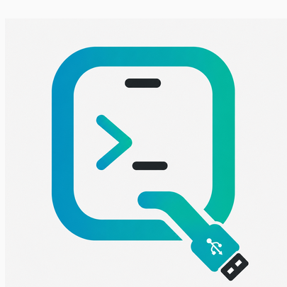
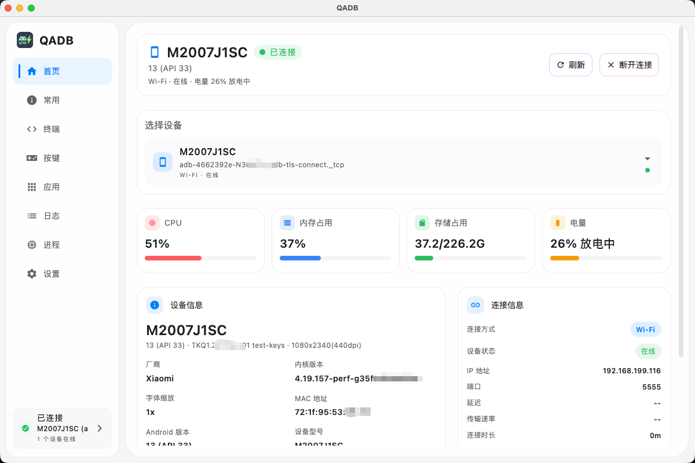
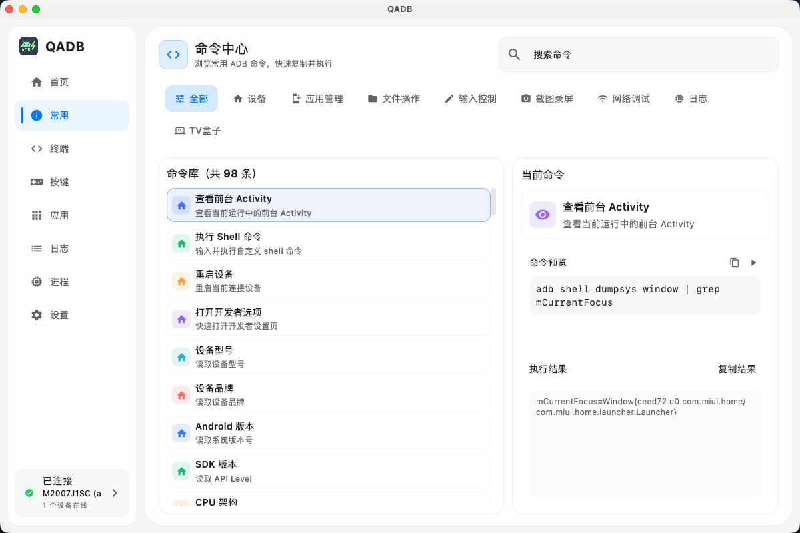
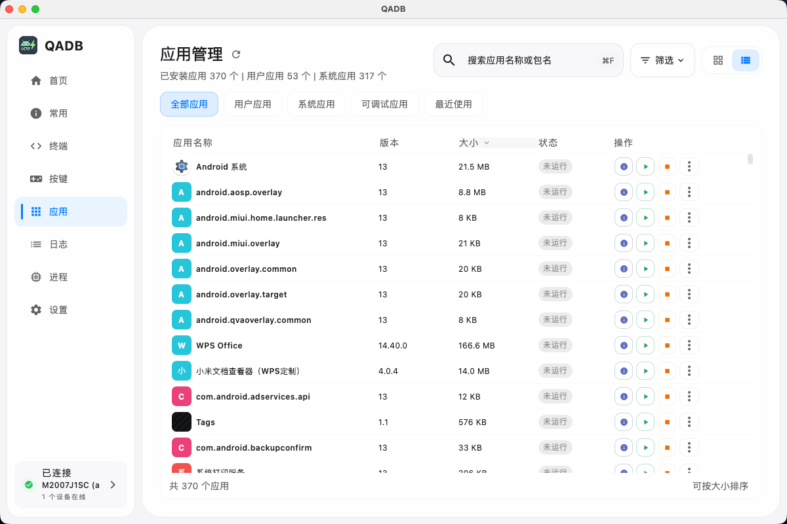
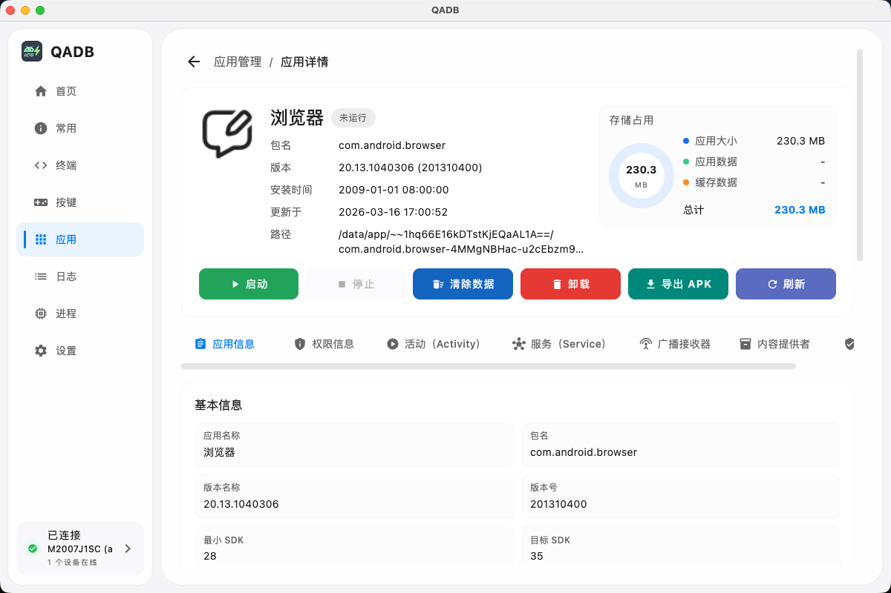
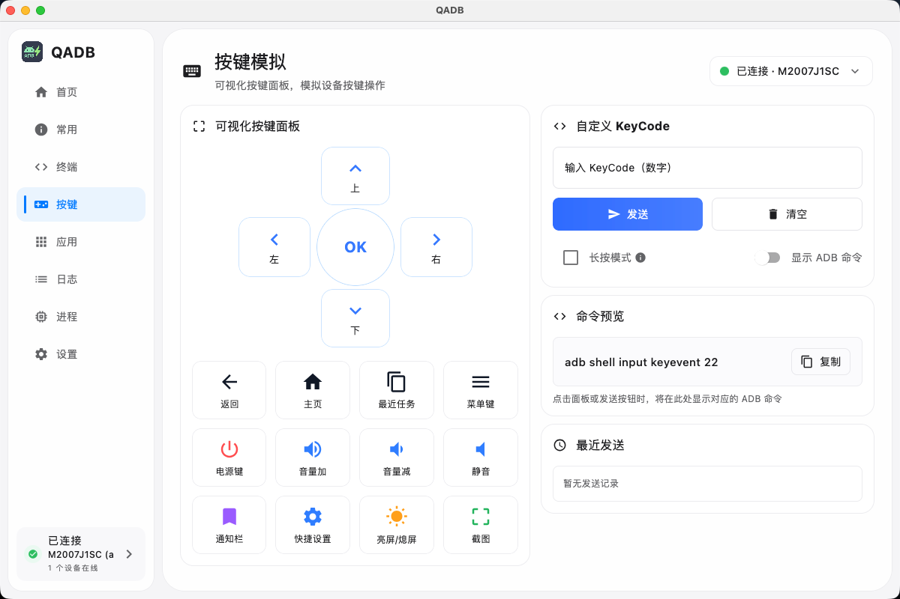
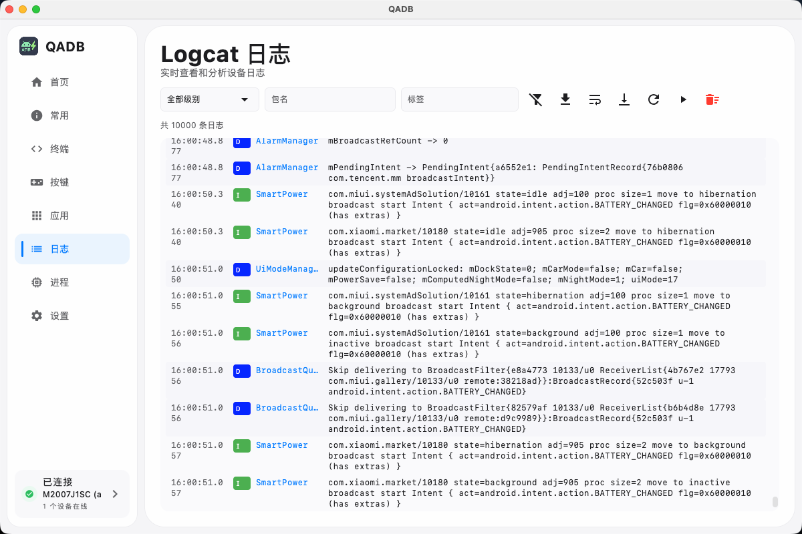
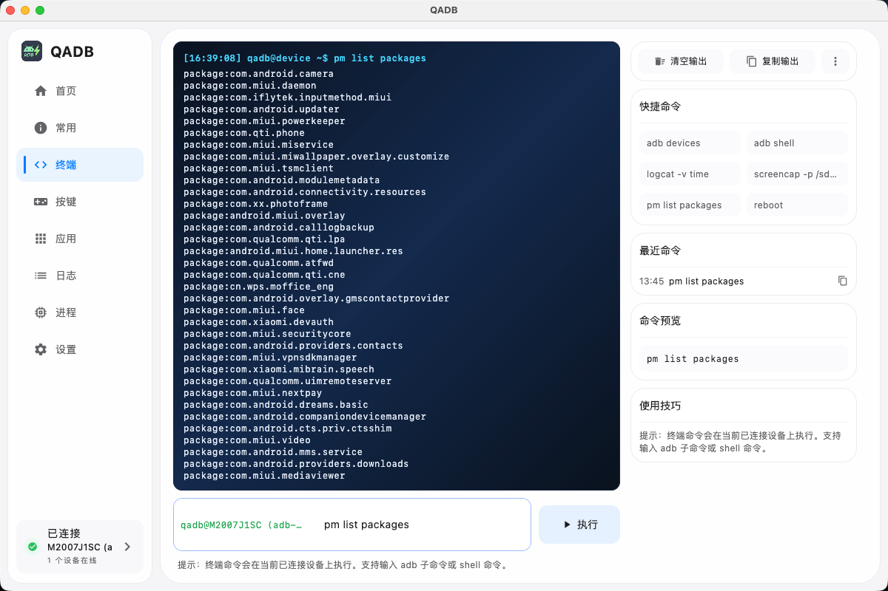

# QADB 2.0.1

<p align="center">
  
</p>

<p align="center">
  基于 <b>Jetpack Compose Multiplatform</b> 的跨平台 ADB 图形化工具，支持 <b>Windows</b> 与 <b>macOS</b>。
</p>

<p align="center">
  <a href="README.md">中文</a> | <a href="README_EN.md">English</a>
</p>

---

## 项目简介

QADB 将常见 ADB 操作封装为桌面端图形界面，面向日常调试、设备管理、应用管理、日志排查和命令执行场景。连接 Android 设备后，可以在一个窗口内完成设备信息查看、常用命令执行、应用列表管理、日志过滤和终端操作。

## 功能概览

- **设备首页**：识别在线设备，展示设备基础信息、连接状态和运行状态。
- **常用操作**：提供重启、关机、截屏、录屏、文件推送/拉取等高频 ADB 操作。
- **应用管理**：查看应用列表，支持安装、卸载、清理数据、导出 APK 和应用详情查看。
- **按键事件**：快速发送常见按键事件，减少手动输入命令的重复操作。
- **日志查看**：查看并过滤 Logcat 日志，辅助定位运行问题。
- **终端命令**：在应用内执行 ADB 命令，保留可视化工具之外的灵活性。

## 界面预览

| 首页 | 常用操作 |
|------|----------|
|  |  |

| 应用列表 | 应用详情 |
|----------|----------|
|  |  |

| 按键事件 | Logcat |
|----------|--------|
|  |  |

| 终端 |
|------|
|  |

## 快速开始

1. 安装 [ADB](https://developer.android.com/tools/adb)，并确保命令行可以执行 `adb`。
2. 连接 Android 设备，开启 USB 调试并授权当前电脑。
3. 启动 QADB，选择设备后执行对应操作。

## 下载发布版

请前往 [GitHub Releases](https://github.com/ludoven/QAdb-Desktop/releases) 获取最新安装包。

- Windows：`QAdb.exe` / `QAdb.msi`
- macOS：`QAdb.dmg`

## 本地开发

运行桌面应用：

```bash
./gradlew :composeApp:run
```

运行桌面测试：

```bash
./gradlew :composeApp:desktopTest
```

打包当前系统发行版：

```bash
./gradlew :composeApp:packageDistributionForCurrentOS
```

## 反馈

问题反馈或功能建议请提交到 [Issues](https://github.com/ludoven/QAdb-Desktop/issues)。

## 声明

本项目仅提供 ADB 图形化封装能力，不包含或修改 ADB 本体。运行依赖系统环境中的 `adb`。
