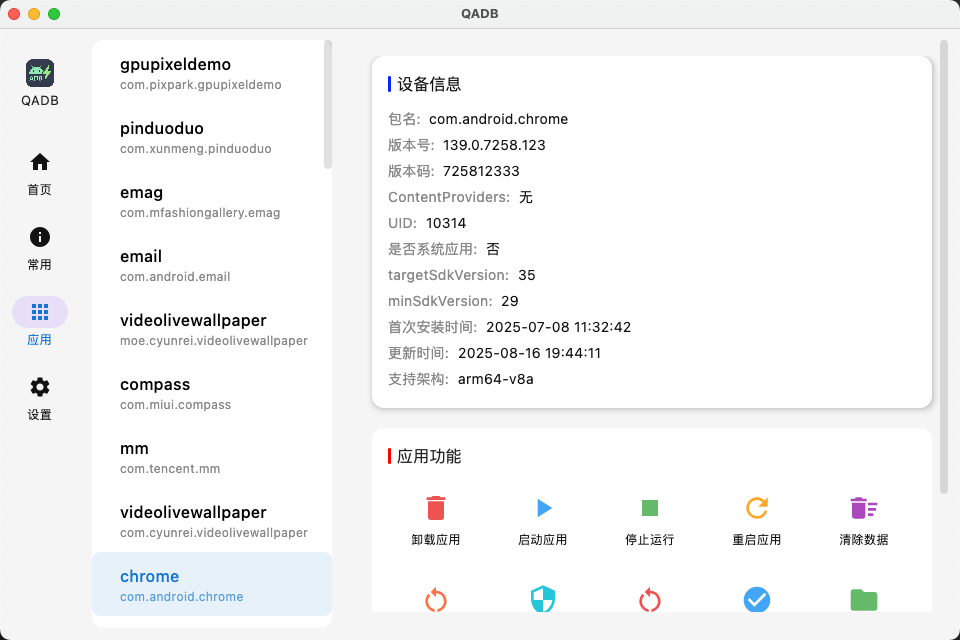

# QAdb-Desktop

  

  🚀 一款基于 <b>Jetpack Compose Multiplatform</b> 的跨平台 ADB 图形化工具  
  支持 <b>Windows</b> 与 <b>macOS</b>，让 ADB 操作更直观、更高效。

---

## ✨ 功能亮点

- 🔍 **设备管理**：快速识别已连接的设备，自动刷新状态
- 📊 **设备信息**：查看详细信息（型号、系统版本、状态等）
- 📱 **常用操作**：重启、关机、截屏、录屏等一键完成
- 📦 **应用管理**：安装、卸载、清除数据、导出 APK
- 🔌 **即插即用**：自动检测设备变化，无需复杂配置

---

## 🖥️ 支持平台

- ✅ Windows
- ✅ macOS

---

## 📦 下载

前往 [👉 GitHub Releases](https://github.com/ludoven/QAdb-Desktop/releases) 获取最新版本：

- 🖥 **Windows**：`QAdb.exe` 或 `QAdb.msi`
- 🍎 **macOS**：`QAdb.dmg`

---

## 📸 界面预览

| 首页 | 常用操作 | 应用管理 |
|------|----------|----------|
|  |  |  |

| 应用功能 | 设置 |
|----------|------|
|  |  |

---

## ⚡ 使用方法

1. 安装 [ADB](https://developer.android.com/tools/adb) 并配置环境变量
2. 打开 QAdb-Desktop，自动加载已连接设备
3. 选中设备后即可进行相应操作

---

## 📮 反馈与建议

如果你在使用过程中遇到问题，或有新功能需求：  
👉 欢迎通过 [Issues](https://github.com/ludoven/QAdb-Desktop/issues) 提交反馈！

---

## 📌 声明

本项目仅作为 **ADB 的图形化封装工具**，不包含或修改 ADB 本身。  
运行依赖系统已安装的 `adb`。  
