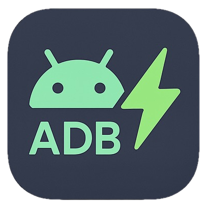
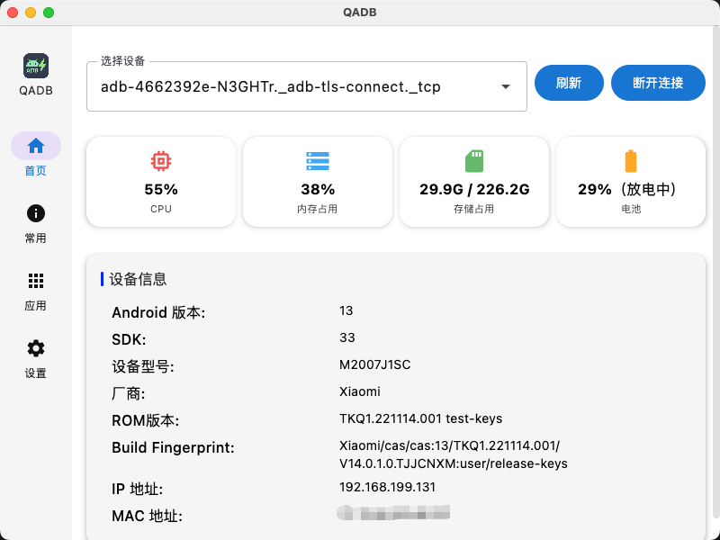
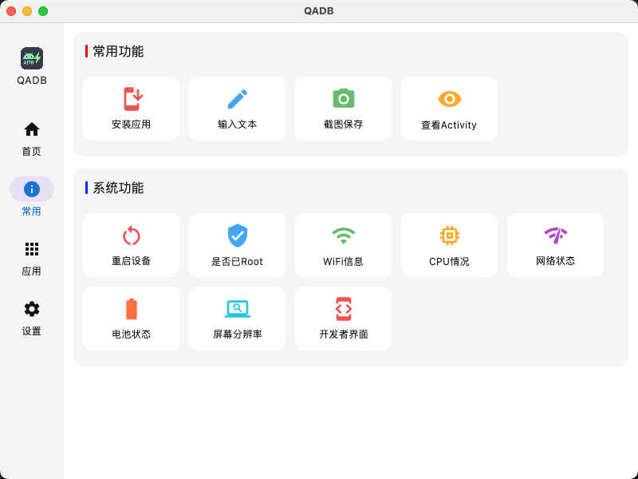
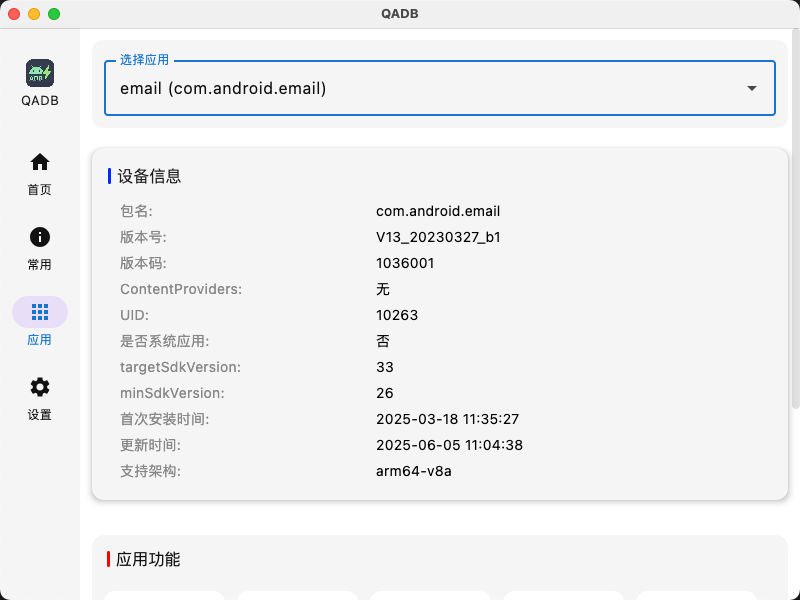
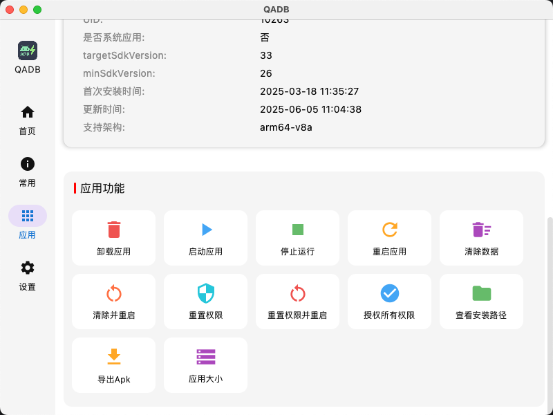
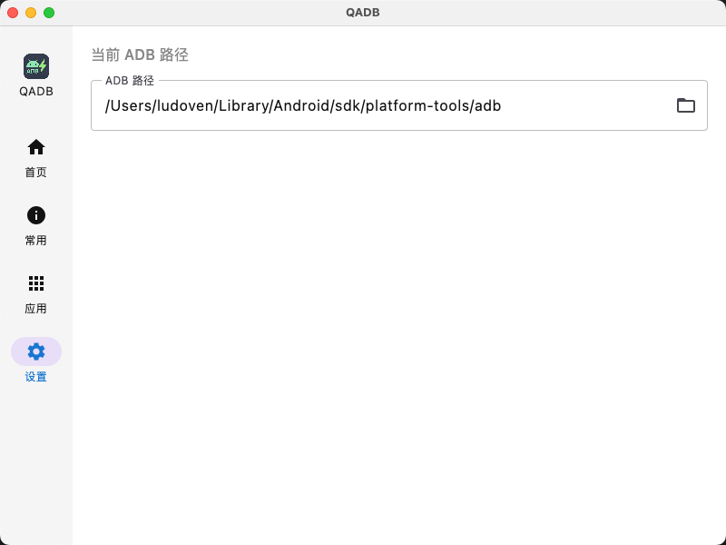

# QAdb-Desktop

  

  🚀 A cross-platform ADB GUI tool based on <b>Jetpack Compose Multiplatform</b> 
  Supports <b>Windows</b> and <b>macOS</b>, making ADB operations more intuitive and efficient.

  <a href="README.md">🇨🇳 中文</a> | <a href="README_EN.md">🇺🇸 English</a>

---

## ✨ Key Features

- 🔍 **Device Management**: Quickly identify connected devices with automatic status refresh
- 📊 **Device Information**: View detailed information (model, system version, status, etc.)
- 📱 **Common Operations**: Reboot, shutdown, screenshot, screen recording with one click
- 📦 **App Management**: Install, uninstall, clear data, export APK
- 🔌 **Plug and Play**: Automatically detect device changes without complex configuration

---

## 🖥️ Supported Platforms

- ✅ Windows
- ✅ macOS

---

## 📦 Download

Go to [👉 GitHub Releases](https://github.com/ludoven/QAdb-Desktop/releases) to get the latest version:

- 🖥 **Windows**: `QAdb.exe` or `QAdb.msi`
- 🍎 **macOS**: `QAdb.dmg`

---

## 📸 Interface Preview

| Home | Common Operations | App Management |
|------|-------------------|----------------|
|  |  |  |

| App Functions | Settings |
|---------------|----------|
|  |  |

---

## ⚡ Usage

1. Install [ADB](https://developer.android.com/tools/adb) and configure environment variables
2. Open QAdb-Desktop, it will automatically load connected devices
3. Select a device to perform corresponding operations

---

## 📮 Feedback & Suggestions

If you encounter problems during use or have new feature requests:  
👉 Welcome to submit feedback through [Issues](https://github.com/ludoven/QAdb-Desktop/issues)!

---

## 📌 Disclaimer

This project is only a **GUI wrapper tool for ADB** and does not include or modify ADB itself.  
Running depends on the system's installed `adb`.